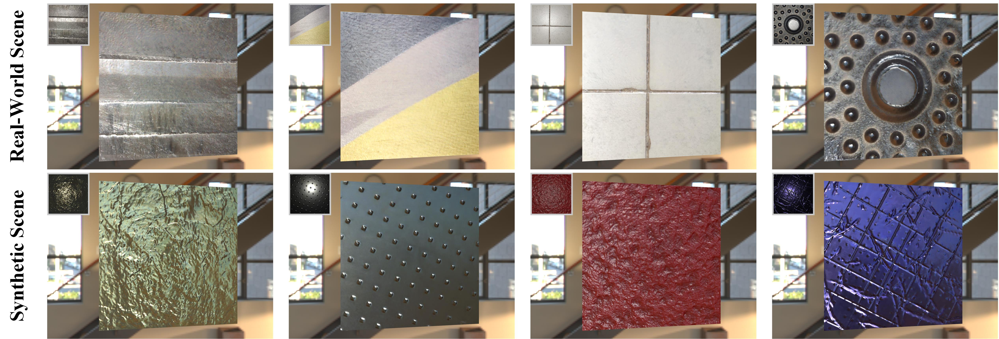

# DeepBasis_SVBRDF
This is the source code of research paper "DeepBasis: Hand-Held Single-Image SVBRDF Capture via Two-Level Basis Material Model" (Proceedings of SIGGRAPH Asia 2023)).
**More information (include our paper, supplementary, video) can be found at** [My Personal Page](https://www.baidu.com) 


# Pretrained models
Our pretrained models can be downloaded from [here](https://www.baidu.com). Download them and extract them into ```./model/ ```

# Dependencies
- Python (with opencv-python, numpy; Python tested on 3.7)
- Pytorch (tested on 1.10.1+CUDA 11.1)

# Usage
- Train mode
```Python
python train.py
  --name DeepBasisTraining   # ss
  --save_root ./output # output folder
  --train_data_root /home/xiaojiu/code/trainBlended # fold
  --test_data_root /home/sda/xiaojiu/dataset/MixtureDataset
  --use_tb_logger
  --fovZ 4
```

- Test mode (synthetic data as input for comparison)
```Python
python test.py
  --name ForOpenSourceData
  --save_root ./output
  --test_data_root /home/sda/xiaojiu/dataset/ForOpenSourceData
  --loadpath_network_g /home/xiaojiu/code/DeepBasis/pretrained/net_g.pth
  --loadpath_network_l /home/xiaojiu/code/DeepBasis/pretrained/net_l.pth
  --fovZ 2.414
```
- Real mode (real-captured images as input)
```Python
python real.py
  --name debug
  --save_root ./output
  --real_data_root /home/xiaojiu/code/DeepBasis/real
  --loadpath_network_g /home/sda/xiaojiu/experiments/NewRender_z_4/models/net_g_400000.pth
  --loadpath_network_l /home/sda/xiaojiu/experiments/NewRender_z_4/models/net_m_400000.pth
  --fovZ 4

```
